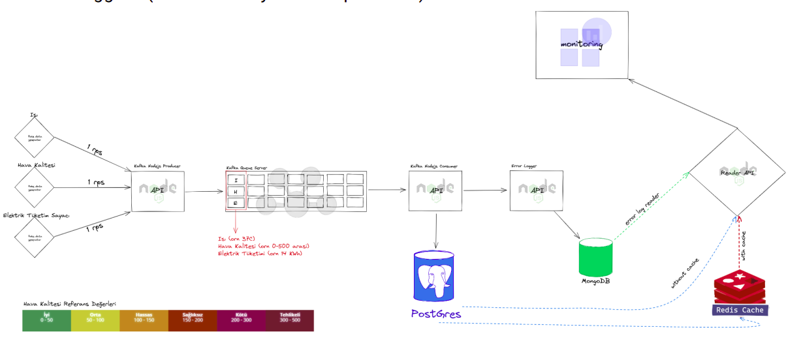

<div align="center">
<h3 align="center">Inavitas Bootcamp Graduation Project</h3>
  

</div>

<!-- TABLE OF CONTENTS -->
<details>
  <summary>Table of Contents</summary>
  <ol>
    <li>
      <a href="#about-the-project">About The Project</a>
      <ul>
        <li><a href="#built-with">Built With</a></li>
      </ul>
    </li>
    <li>
      <a href="#getting-started">Getting Started</a>
      <ul>
        <li><a href="#prerequisites">Prerequisites</a></li>
        <li><a href="#installation">Installation</a></li>
      </ul>
    </li>
    <li><a href="#roadmap">Roadmap</a></li>
    <li><a href="#team-members">TEAM</a></li>
  </ol>
</details>

<!-- ABOUT THE PROJECT -->

## About The Project

### OKUL Enerji Takip Sistemi

A microservice series will be made in which we will be able to track the temperature, air quality, and average electricity consumption of the classrooms in the schools. 3 different sensors will be simulated and generate data in seconds. This generated data will be read by the REST API (producer) and added to the queue. The REST API(consumer) side will again process the processing of the data added to the queue and save it to the database. In case of an error, the error logs to Mongodb will be processed with another API. Finally, a Reader API has been developed to read all the data and keep track of error logs, and everything in the system can be analyzed or monitored using this API.

- 3 different databases will be used in the system.
- All Services will be written in NodeJS.
- Docker technology will be used as the development environment.
- Docker files with Nodejs Microservice bone structure were created and distributed to all students.
- A short-term cache structure will also be used with Redis.
- The project was explained to the students at the introductory level.
- All students will work in clusters in groups of 6 people.
- At the head of each group will be a router and an Inavitas employee who will help each router. Figure 2 also lists the working groups.
- In Figure 1, the outline and structure of the project are shown in a diagram.
<div align="center"><p>Figure 1</p></div>

## Microservices

- Sensor reader (Producer)
- Kafka data reader (Consumer)
- Error Log collector
- Data reader class by class

## Sensors & Tools

- Heat sensor
- Air Quality Measurement
- Electricity Consumption Meter

## Built With

- [Node.js](https://nodejs.org/en/)
- [PostgreSQL](https://www.postgresql.org/)
- [Redis](https://redis.io/)
- [MongoDB](https://www.mongodb.com/)
- [Kafka.js](https://kafka.apache.org/)

<div id="top"></div>

<!-- GETTING STARTED -->

## Getting Started

To get a local copy up and running follow these simple example steps.

### Prerequisites

- Node-js
- Postgresql
- MongoDB
- Redis
- Kafka
- Postman

### Installation

1. Clone the repo
   ```sh
   git clone https://github.com/P149-Bootcamp-Graduation-Project/Group1.git
   ```
2. Install NPM packages for core-reader-api and run
   ```sh
   cd core-reader-api
   npm install
   npm run dev
   ```
3. Install NPM packages for error-loggerer-api and run
   ```sh
   cd error-loggerer-api
   npm install
   npm run dev
   ```
4. Install NPM packages for kafka-consumer-api and run
   ```sh
   cd kafka-consumer-api
   npm install
   npm run dev
   ```

<!-- ROADMAP -->

## Roadmap

```
GROUP1
├── core-reader-api
│   ├── app
│   │   ├── adapters
│   │   │   └── database
│   │   ├── controllers
│   │   │   ├── air-logs
│   │   │   ├── classes
│   │   │   ├── electric-logs
│   │   │   ├── schools
│   │   │   ├── sensors
│   │   │   ├── temperature-logs
│   │   │   └── users
│   │   │       └── auth
│   │   ├── libs
│   │   │   └── swagger
│   │   ├── middleware
│   │   ├── models
│   │   ├── routes
│   │   └── services
│   └── docs
├── error-logger-api
│   ├── app
│   │   ├── adapters
│   │   │   └── database
│   │   ├── controllers
│   │   ├── libs
│   │   │   └── swagger
│   │   ├── models
│   │   ├── routes
│   │   └── service
│   └── docs
├── kafka-consumer-api
│   ├── app
│   │   └── adapters
│   │       ├── database
│   │       └── queue
│   └── docs
└── kafka-producer-api
    ├── app
    │   ├── adapters
    │   │   └── queue
    │   ├── controllers
    │   │   └── sensors
    │   └── routes
    └── docs
```

<!-- ACKNOWLEDGMENTS -->

## Team Members

- [Ömer Alper ODAMAN](https://github.com/alperodaman)
- [Burak ALTUNTAŞ](https://github.com/baltuntas3)
- [Beyzanur AKIN](https://github.com/beyzanurakin)
- [Emirhan YILMAZER]()

<p align="right">(<a href="#top">back to top</a>)</p>
